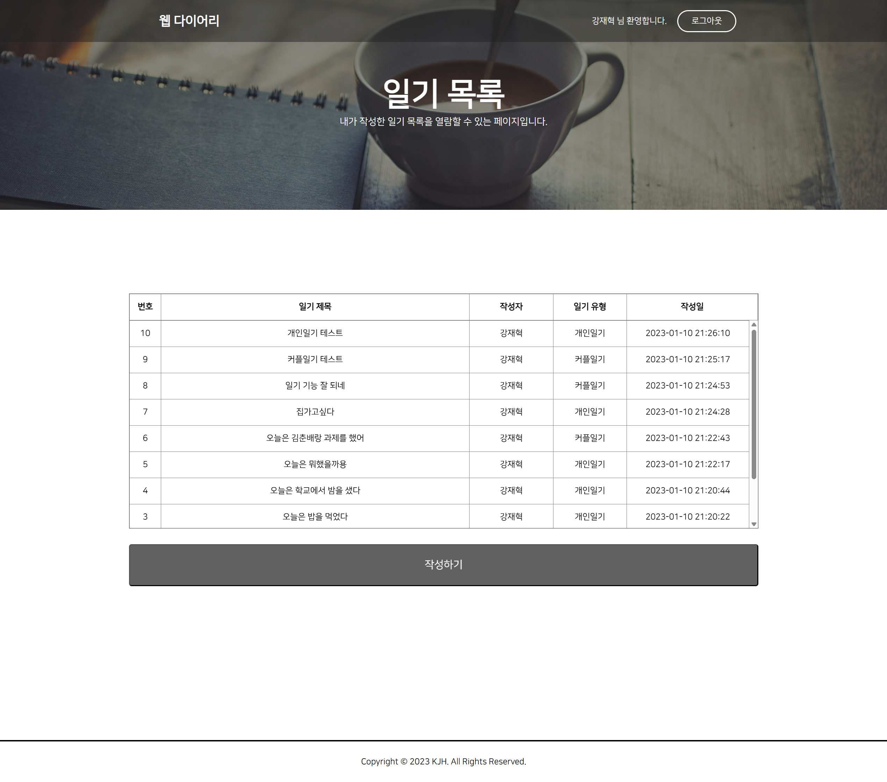
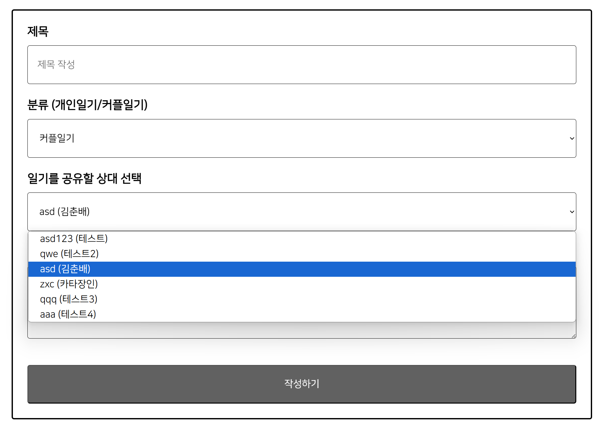
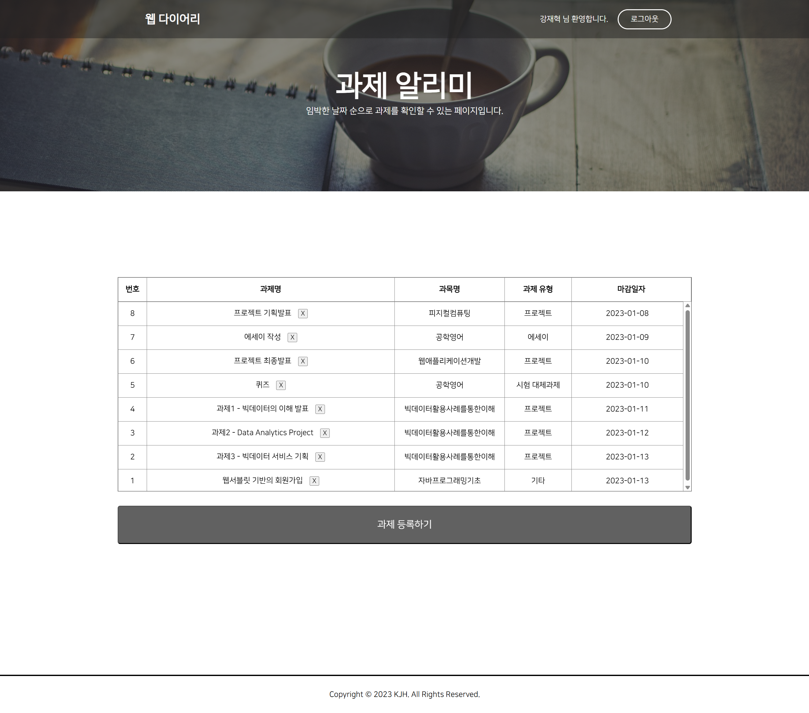
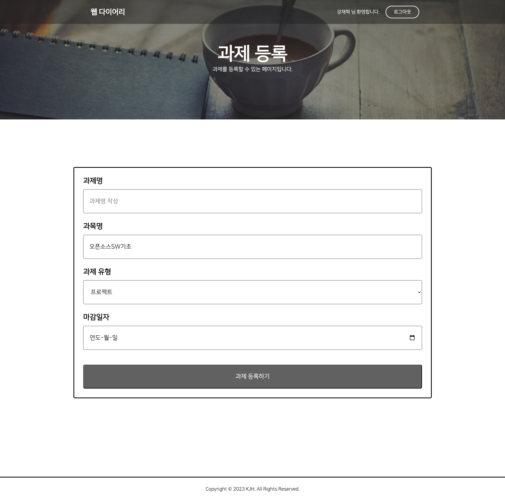
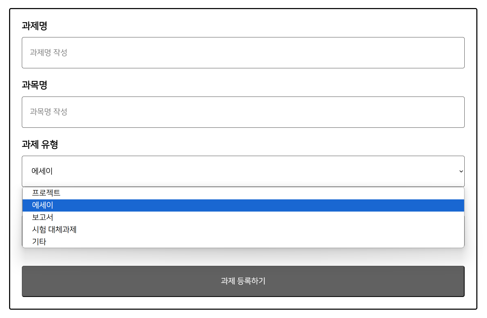
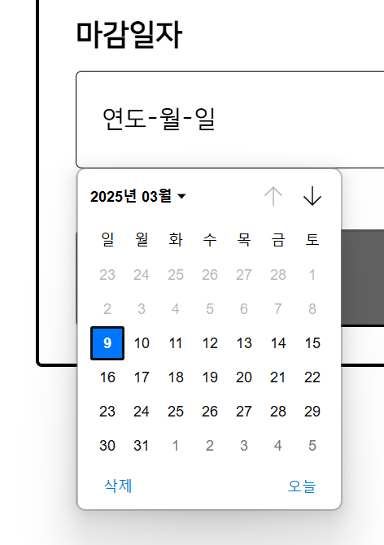
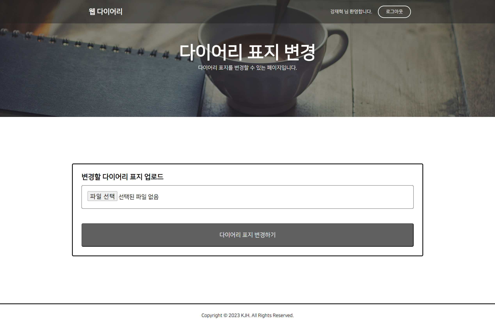

# 2022-ERICA-webProject
한양대학교 ERICA 2022 웹애플리케이션개발 강의 과제 : 자율주제 웹 프로젝트

## 💻 프로젝트 소개
2022학년도 1학년 겨울 계절학기 수업 中 [웹애플리케이션개발, 전공핵심/3학점] 수업에서 진행한 **자율 주제 웹 프로젝트**입니다.

제가 정한 프로젝트 주제는 **웹 다이어리** 입니다.

## 📅 개발 기간
- 2022.12.26 ~ 2023.01.10 (15일)

## 🧑🏻‍💻 사용한 프로그램 및 언어
- **프로그램** : XAMPP(phpMyAdmin)
- **DBMS** : MySQL
- **IDE** : Visual Studio Code(VSCode)
- **웹 서버** : Apache HTTP Server
- **언어/라이브러리** : HTML, CSS, JS, PHP, jQuery

## 📖 코드 실행 방법
1. xampp 압축 파일 다운로드
2. C:\ (C드라이브 최상위 디렉토리)에 압축 해제
3. xampp 폴더에 들어가서 **xampp-control.exe** 실행
4. **Apache, MySQL** 부분의 **Start** 버튼 클릭하여 실행
   - 초록색으로 바뀌면 실행 성공, 실행이 안될 시 작업관리자에서 실행된 Apache, mysqld 프로그램을 종료 후 재실행
   - 단, Apache나 MySQL이 이미 설치되어 있는 상태에서는 포트 충돌 등으로 인해 실행이 안될 수도 있습니다. 웹 서버나 MySQL을 한 번도 설치하지 않은 환경에서는 100% 정상 실행됩니다.
5. 브라우저 주소창에 localhost 를 입력하여 접속하면 됩니다.
   - 코드 위치 폴더: xampp 폴더 내부에, htdocs 폴더

## 📖 DB 접근 방법
1. 위의 코드 실행 방법의 1~5 까지 모두 동작하는 상태여야 합니다.
2. 브라우저 주소창에 http://localhost/phpmyadmin/index.php?route=/database/structure&db=web_diary 을 입력하면 됩니다.

## 📌 주요 기능
#### 로그인
- MySQL SELECT문을 통해 DB값 검증
- 로그인 시 Session 생성

#### 회원가입
- 아이디 중복 체크
- 아이디 20자 이하인지 체크
- 이름 7자 이하인지 체크
- 한줄 소개 25자 이하인지 체크
- MySQL INSERT문을 통해 DB에 아이디 저장

#### 메인 페이지(로그아웃 상태)
- 로그인/회원가입 버튼 활성화
- 로그아웃 버튼 비활성화
- 각종 기능 접근 시 alert창으로 "로그인 후 이용해주세요." 메시지 표시(접근 불가능)

#### 메인 페이지(로그인 상태)
- 일기 작성 페이지 접근 가능
- 일기 목록 페이지 접근 가능
- 과제 알리미 페이지 접근 가능
- 한줄 소개 변경 페이지 접근 가능
- 다이어리 표지 변경 페이지 접근 가능
- 로그인/회원가입 버튼 비활성화
- 로그아웃 버튼 활성화

#### 일기
- 일기 작성(제목, 
- 개인일기, 커플일기 선택 가능
- 커플일기는 다른 user의 아이디를 선택하여 작성할 수 있으며, 두 user가 모두 조회 가능
- 일기 목록 조회
- 일기 열람(일기 목록에서 일기 제목을 클릭하면 해당 일기 열람 가능)
- 일기 삭제

#### 과제 알리미
- 과제 등록
- 과제 목록 조회(기한이 얼마 안남은 과제부터 상단으로 올라오도록 오름차순 정렬)
- 과제 삭제(과제명 옆에 X 버튼을 클릭하면 삭제 가능)

#### 한줄 소개
- 회원가입 시 최초 입력
- 25자 이하로 작성 가능
- 메인 페이지의 '한줄 소개 변경' 버튼을 누르면 변경 가능 페이지로 이동하도록 구성하여, 회원가입 이후에도 변경할 수 있도록 함

#### 다이어리 표지
- 회원가입 시 최초 이미지 업로드
- 메인 페이지의 '다이어리 표지 변경' 버튼을 누르면 변경 가능 페이지로 이동하도록 구성하여, 회원가입 이후에도 변경할 수 있도록 함

## 📌 주요 페이지
#### ✔️ 메인 페이지(비로그인 상태)

  

  

#### ✔️ 회원가입 modal

  

  

#### ✔️ 로그인 modal

  

  

#### ✔️ 메인 페이지(로그인 상태)

  

- 회원가입 시 등록했던 한줄 소개 및 이미지 활성화

  

#### ✔️ 일기 목록 페이지

  

  

#### ✔️ 일기 작성 페이지

  

##### ❗분류 커플일기 선택 시, 공유 상대 select box 활성화

  

  

#### ✔️ 일기 열람 페이지(개인일기)

  

  

#### ✔️ 일기 열람 페이지(커플일기)

  

- 일기 작성자와 현재 로그인된 유저가 다르지만, 일기를 조회할 수 있는 것을 확인할 수 있다.

  

#### ✔️ 과제 알리미 페이지

  

  

#### ✔️ 과제 등록 페이지

  

##### ❗과제 유형에 따라 프로젝트, 에세이, 보고서, 시험 대체과제, 기타 총 5가지 선택 가능

  

##### ❗마감일자 오른쪽 달력 버튼 클릭 시, 마감일자 선택 가능(오늘 기준 이전 날짜는 선택 불가능하도록 구현함)

  

  

#### ✔️ 한줄 소개 변경 페이지

  

  

#### ✔️ 다이어리 표지 변경 페이지

  

##### ❗다이어리 표지 업로드(선택) 상태

  

